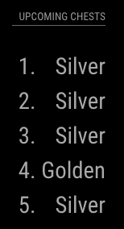

# MMM-ClashRoyaleChests
This is a MagicMirror module for people with a ClashRoyale account. This module will show you your next chests to open in ClashRoyale

# Screenshots


# Prerequisites
* You should have an active Clash Royale Developer account.  If you do not have an account you can [register for an account](https://developer.clashroyale.com/#/register).
* Once you have an account, [create a new key](https://developer.clashroyale.com/#/new-key)
* You should have a Clash Royale Account
* You should have your Clash Royale Player Tag
   * You can use the [Royale Chests FAQ](https://royalechests.com/faq) to find your Clash Royale Player Tag

# Installation
1. Go to the `modules` directory of your MagicMirror installation:
   ```sh
   cd ~/MagicMirror/modules
   ```
1. Clone this module into that folder:
   ```sh
   git clone https://github.com/chicohernando/MMM-ClashRoyaleChests.git
   ```
1. Configure this module in your MagicMirror config/config.js file
   ```js
   {
     module: "MMM-ClashRoyaleChests",
     position: "top_left",
     header: "Chico Hernando's Upcoming Chests",
     config: {
       api_key: "",
       player_tag: "",
     }
   },
   ```

# Configuration

|Name|Required|Type|Description|Default|Options|
|----|--------|----|-----------|-------|-------|
|`api_key`|Yes|string|Your API key, or token, from the Clash Royale Developer site|||
|`player_tag`|Yes|string|Your Clash Royale Player Tag||The # in your player tag is optional|
|`refresh_every`|No|int|Defines, in seconds, how often the data should refresh|`300` (five minutes)|Numbers between the values of `60` (one minute) and `86400` (24 hours)|
|`limit`|No|int|Defines the number of upcoming chests to display|`5`|Numbers between the values of `1` and `9`|
|`debug`|boolean|Control whether the module is in debug mode or not, this can be useful during setup if you are having difficulties|`false`|`true`, `false`|